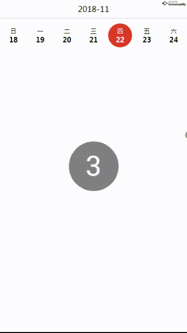

# v-week-slider
## 介绍
一个基于Vue无限滑动选择日期的手机端组件

## DEMO


## 安装
```html
npm install --save v-week-slider
```

## 使用
```html
import weekSlider from 'v-week-slider'

Vue.use(weekSlider)

<week-slider @dateClick="dateClickhandler" :showYear="true" :defaultDate.sync="default_date"></week-slider>
```

## Props
|prop|必选|类型|说明|
|:----    |:---|:----- |-----   |
| defaultDate   | false  | String  | 指定日期，默认今天，YYYY-MM-DD |
| showYear  | false  | Boolean  | 是否显示当前周所属年月，默认false  |
| activeBgColor  | false  | String  | 指定日期背景颜色，，默认'rgba(182, 30, 40, 1)'  |
| todayBgColor  | false  | String  | 今天背景颜，非必须|
| activeTxtColor  | false  | String  | 指定日期文字颜色，默认'rgba(255, 255, 255, 1)'  |
| todayTxtColor  | false  | String  | 今天文字颜色，非必须|
| lang  | false  | String  | 周语言，ch(中文) en(英语)，默认ch|

## events
|名称|说明|回调参数|
|:----    |:---|:----- |
| dateClick  | 点击日期触发时间  |  点击的日期（YYYY-MM-DD） |

##Tips
当选中日期为今天时默认采用activeBgColor，activeTxtColor标记该日期
